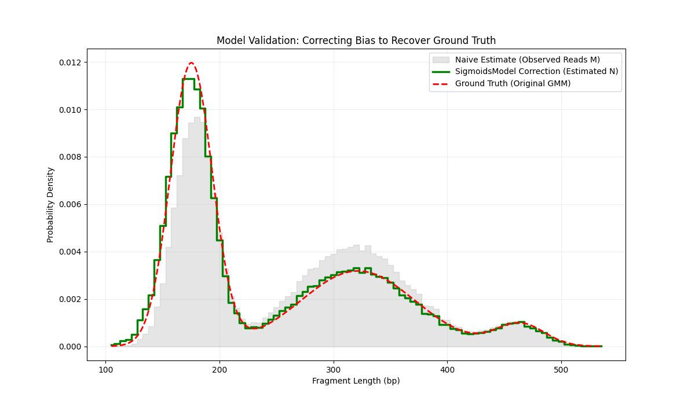

# SigmoidsModel: PCR Length Bias Correction for cfDNA

This project provides a computational tool to estimate and correct fragment length biases induced by PCR amplification and sequencing processes, specifically designed for cell-free DNA (cfDNA) data.

## 🧬 The Problem
In cfDNA sequencing, PCR amplification and library preparation often exhibit significant bias based on fragment length. Since the length distribution of cfDNA is a critical feature for clinical diagnostics (e.g., cancer detection), these technical biases can distort biological signals and lead to inaccurate quantification.

## 🛠️ The Solution
`SigmoidsModel` implements a mathematical approach to "un-bias" the data:

1.  **Efficiency Estimation**: It models the sequencing efficiency ($\lambda$) per length bin using a Poisson-based approach.
2.  **Double Sigmoid Fit**: It fits a continuous "band-pass" sigmoid function to these estimates to smooth out noise and capture the rising and falling efficiency gates.
3.  **Data Correction**: It applies a correction factor ($N \approx M/\lambda$) to recover the original molecule counts ($N$) from the observed read counts ($M$).

## 🧪 Validation Results
The model was validated using a **Synthetic Data Generator** that simulates a 3-Gaussian Mixture Model (GMM) library. As shown below, the corrected distribution (green) perfectly recovers the ground truth (red dashed), while the naive observed reads (gray) remain biased.



## 📂 Project Structure
* `sigmoids_model/`: Core package containing the `SigmoidsModel` class.
* `simulation/`: Tools for generating synthetic cfDNA data for testing.
* `notebooks/`: Demonstration of the validation experiment and usage examples.

## 🚀 Getting Started
1. **Clone the repository**:
   ```bash
   git clone [https://github.com/YourUsername/SigmoidsModel.git](https://github.com/YourUsername/SigmoidsModel.git)

## Install dependencies
Ensure you have Python installed, then run:
pip install -r requirements.txt

## Run the demo
Open the provided Jupyter Notebook to see the model in action:
jupyter notebook notebooks/validation_demo.ipynb